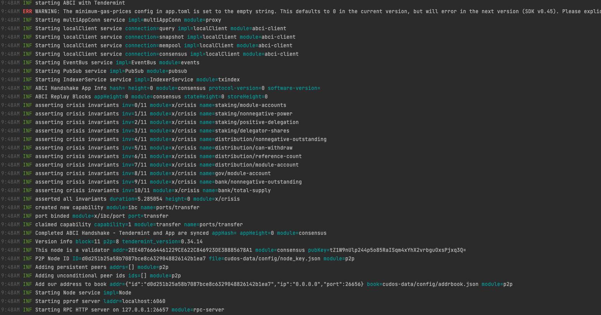

# Phase 4 Step 3 instructions

If you executed Step 1 instructions and got the green light from the Cudos team you can proceed with setup of your seed and sentry nodes. After that you'll start all nodes and connect to the network.
## Prerequisites
Check all the needed prerequisites [here](./prerequisites.md).
## Setup of the sentry node

### Setup the environment
You need to have an up to date local copy of our build tools.

```
cd $HOME
git clone --branch v0.9.0 https://github.com/CudoVentures/cudos-builders.git CudosBuilders
cd CudosBuilders/tools-bash/constructor
```

You should copy the example configuration and setup all needed params
```
cp ./config/init-peers.env.example ./config/init.env
```
The content of the init.env should be as follows:
```bash
PARAM_SOURCE_DIR="/usr/cudos" 
```
The directory you create here should exist.

Time to fill the information for the node configuration. First copy the node.env.example and fill it in the next step.
```
cp ./config/node.env.example ./config/node.env
```
The content of the node.env should be:
```bash
MONIKER="<TYPE DOWN NODE NAME>"
PRIVATE_PEERS="<validator node tendermint id>"

SHOULD_USE_GLOBAL_PEERS="false"
SHOULD_USE_STATE_SYNC="false"

TLS_ENABLED="false"
TLS_DOMAIN=""
TLS_DOCKER_PATH=""

MONITORING_ENABLED="false"

EXTERNAL_ADDRESS=""
ADDR_BOOK_STRICT="true"
```
For now we can leave the information about the peers empty. 

**MONIKER** is the name of the node. It MUST contains only lowercase english letters and/or a dash.

**PRIVATE_PEERS** list with the node ID of any Validator nodes on your private network with format: <_tendermint_id_>.

**SHOULD_USE_GLOBAL_PEERS** if the node should try to connect to global peers or not. Should be set to true.
**SHOULD_USE_STATE_SYNC** if set to true the node will try to sync from a state sync point.

**TLS_ENABLED** this value must be "false"

**TLS_DOMAIN** this value must be empty

**TLS_DOCKER_PATH** this value must be empty

**MONITORING_ENABLED** defines if the port for monitoring should be open or not.

**EXTERNAL_ADDRESS** This variable defines the address to advertise to peers for them to dial. It must be the public address of the node plus the 26656 (or any other external number that could be redirected to internal port 26656) port.

**ADDR_BOOK_STRICT** connect only to peers in the address book.


```
sudo ./src/init.sh sentry-node
```

If you executed this step correctly you should see the following log:
```shell
Processing arguments...OK
Processing variables...OK
Validating...OK
Cloning the repos...OK
Copying the .env files...OK
Preparing the binary builder...OK
Preparing the sentry-node...OK
Configurating the sentry-node...OK

This node ID is: 3c8b529b9eeef3a6240284ae5ca8d9add378674f
This node ID can be found at $HOME/CudosData/cudos-data-sentry-node-client-mainnet/tendermint.nodeid
This node ID could always be checked using cudos-noded tendermint show-node-id

You MUST NOT delete the constructor script nor the destination folder where node's data is. They will be used later on for starting the nodes.

Initialiazing...DONE
```
Note your node ID. You are going to need it for the next steps of the configuration.

## Setting up seed node
### Setup the environment
You need to have a local copy of our build tools.Create your main Cudos directory. On the first row you can define where all Cudos data will be stored.

```
mkdir /usr/cudos

cd $HOME
git clone --branch v0.9.0 https://github.com/CudoVentures/cudos-builders.git CudosBuilders
cd CudosBuilders/tools-bash/constructor
```

You should copy the example configuration and setup all needed params
```
cp ./config/init-peers.env.example ./config/init.env
```
The content of the init.env should be as follows:
```shell
PARAM_SOURCE_DIR="/usr/cudos" 
```
The directory you create here should exist.

Time to fill the information for the node configuration:
```
cp ./config/node.env.example ./config/node.env
```
The content of the node.env should be:
```shell
MONIKER="<name of the node>"
PRIVATE_PEERS=""

SHOULD_USE_GLOBAL_PEERS="false"
SHOULD_USE_STATE_SYNC="false"

MONITORING_ENABLED="false"

EXTERNAL_ADDRESS=""
ADDR_BOOK_STRICT="true"
```

**MONIKER** is the name of the node. It MUST contains only lowercase english letters and/or a dash.

**PRIVATE_PEERS** list with the node ID of any Validator nodes on your private network with format: <_tendermint_id_>.

**SHOULD_USE_GLOBAL_PEERS** if the node should try to connect to global peers or not. Should be set to true.
**SHOULD_USE_STATE_SYNC** if set to true the node will try to sync from a state sync point.

**TLS_ENABLED** enables TLS. Default false

**TLS_DOMAIN** required if TLS_ENABLED=true

**TLS_DOCKER_PATH** required if TLS_ENABLED=true

**MONITORING_ENABLED** defines if the port for monitoring should be open or not.

**EXTERNAL_ADDRESS** This variable defines the address to advertise to peers for them to dial. It must be the public address of the node plus the 26656 (or any other external number that could be redirected to internal port 26656) port.

**ADDR_BOOK_STRICT** connect only to peers in the address book.

For now we can leave the information about the peers empty

```
sudo ./src/init.sh seed-node
```

If you executed this step correctly you should see the following log:

```shell
Processing arguments...OK
Processing variables...OK
Validating...OK
Cloning the repos...OK
Copying the .env files...OK
Preparing the binary builder...OK
Preparing the seed-node...OK
Configurating the seed-node...OK

This node ID is: a3831e25275f9f3a81e0d2a7c7b0d947bc6e4512
This node ID can be found at $HOME/CudosData/cudos-data-seed-node-client-mainnet/tendermint.nodeid
This node ID could always be checked using cudos-noded tendermint show-node-id

You MUST NOT delete the constructor script nor the destination folder where node's data is. They will be used later on for starting the nodes.

Initialiazing...DONE
```
Note your node ID. You are going to need it for the next steps of the configuration.

****

## Validator setup

If you successfully submitted your genesis in the previous step of Phase 4 your validator node is already initialized and setup. If you deleted your configuration contact Cudos team for support.
## Start the sentry and seed nodes

### Sentry node

Copy the start-peers.env.example and rename it to start.env. 
```
cp ./tools-bash/constructor/config/start-peers.env.example ./tools-bash/constructor/config/start.env
```
Enter the newly copied file with the command below:
```
nano ./tools-bash/constructor/config/start.env
```
Leave the **PARAMS_SEED** and **PARAM_PERSISTENT_PEERS**. They represent the Cudos peers - you'll need them to connect to the network. Then only change is the following:

```
PARAM_PRIVATE_PEER_IDS="<validator_tendermint_id>"
PARAM_EXPOSE_IP="0.0.0.0"
```

**PARAM_PRIVATE_PEER_IDS** contains the validator tendermint node ID. <em>Example: PARAM_PRIVATE_PEER_IDS="2faaf03451abe212561affffbee119835a4a94ae"</em>

```
sudo ./src/start.sh sentry-node
```
NOTE: There may be an error for the Resetting the sentry-node step.
### Seed node

Copy the start-peers.env.example and rename it to start.env. 
```
cp ./tools-bash/constructor/config/start-peers.env.example ./tools-bash/constructor/config/start.env
```
Enter the newly copied file with the command below:
```
nano ./tools-bash/constructor/config/start.env
```
Leave the **PARAMS_SEED** and **PARAM_PERSISTENT_PEERS**. They represent the Cudos peers - you'll need them to connect to the network. Then only change is the following:

```
PARAM_PRIVATE_PEER_IDS="<validator_tendermint_id>"
PARAM_EXPOSE_IP="0.0.0.0"
```

**PARAM_PRIVATE_PEER_IDS** contains the validator tendermint node ID. <em>Example: PARAM_PRIVATE_PEER_IDS="2faaf03451abe212561affffbee119835a4a94ae"</em>

```
sudo ./src/start.sh seed-node
```
NOTE: There may be an error for the Resetting the seed-node step.

****
## Start the validator node

## Get the genesis

Once the Cudos team has setup their nodes and you've got the green light to continue with this step.
<!-- you need to make sure you have the correct genesis file. It should be located in the cudos-builders config folder. 

```
cd $HOME/CudosBuilders
git pull
```

All the nodes listed bellow need to have the same genesis. Otherwise they won't be connected to the root validator. This step should be executed for every node in the cluster. -->

<!-- ### Manual setup of genesis

If you want to manualy provide a genesis file for your nodes you need to place it in the <code>$HOME/CudosBuilders/tools-bash/config/genesis.mainnet.json </code>. This step should be executed for every node in the cluster. -->

## Start the node
To start the validator first setup it's environement. Copy the start.env.example and rename it to start.env. 
```
cp ./tools-bash/constructor/config/start-peers.env.example ./tools-bash/constructor/config/start.env
```
Enter the newly copied file with the command below:
```
nano ./tools-bash/constructor/config/start.env
```
Then enter the following:

It should contain the following. Leave the **PARAMS_SEED** and **PARAM_PERSISTENT_PEERS**. They represent the Cudos peers - you'll need them to connect to the network. Then only change is the following:
```
PARAM_PRIVATE_PEER_IDS="<validator_tendermint_id>"
PARAM_EXPOSE_IP="0.0.0.0"
```

**PARAM_PERSISTENT_PEERS** Add the node ID and IP address+port of ALL Sentry nodes on your private network, eg node 3 sentry must connect to Node1 Sentry and Node 2 Sentry

**PARAM_SEED** node ID and IP address+port of ALL Seed nodes on your private network, eg Node 3 Seed must connect to node 1 Seed and Node 2 Seed.

**PARAM_EXPOSE_IP** the IP that would be exposed. Default is 0.0.0.0

If your validator is running an orchestrator also add:
```
PARAM_ORCHESTRATOR_ENV_PATH=""
PARAM_ORCH_ETH_ADDRESS=""
```

You can see the gravity instructions [here](./gravity.md).

Now you can run
```
sudo ./src/start.sh clustered-validator-node
```

# Successful run of your nodes
If your node connected to the network but 2/3 of the voting power is not online your nodes will log something similar to:


Once 2/3 of the voting power is online the logs will print:

```
INF executed block height=1 module=state num_invalid_txs=0 num_valid_txs=0
INF commit synced commit=436F6D6D697449447B5B3131362032313920313338203838203232352031313720313534203233392031393420373620313734203137352038382031353020313020313837203138372032333820323137203238203233322031343120393020313838203135382034322035392032353220313237203835203235352038315D3A317D
INF committed state app_hash=74DB8A58E1759AEFC24CAEAF58960ABBBBEED91CE88D5ABC9E2A3BFC7F55FF51 height=1 module=state num_txs=0
INF indexed block height=1 module=txindex
```
